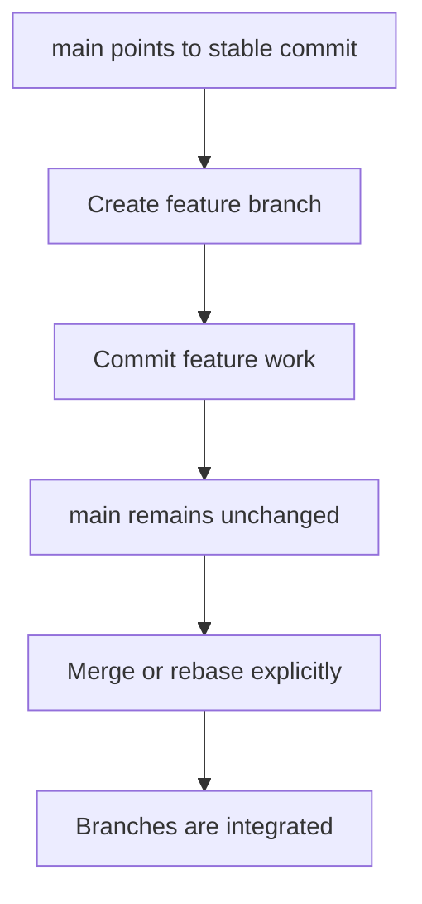

# Understand the Git branch model

A Git branch is a movable name that points to a commit. It is not a separate copy of the project files.

## A branch starts at a commit

Suppose the repository has one line of history:

```text
A -- B -- C
          ^
         main
```

Creating a branch at the current commit gives two names to the same point in history:

```bash
git switch -c feature
```

```text
A -- B -- C
          ^
     main, feature
```

At this point, `main` and `feature` refer to the same commit. No new commit has been created yet.

## Commits move the current branch

When you commit while on `feature`, Git moves only the `feature` name forward:

```text
A -- B -- C -- D -- E
          ^         ^
         main     feature
```

`main` remains at `C` until you explicitly merge, rebase, or otherwise move it. You can switch back to `main`, and its files will reflect the commit to which `main` points.

## Branches are lines of development

Git does not treat `main` as a technically superior branch. `main` is a common project convention, usually used for the default or stable branch on a hosting service.

A project may give different branches different roles:

| Branch              | Possible role                |
| ------------------- | ---------------------------- |
| `main`              | Stable or releasable history |
| `develop`           | Integration history          |
| `feature/<name>`    | Isolated feature work        |
| `release/<version>` | Release preparation          |

The team defines these roles. Git stores the references and history but does not decide which branch is the successor.

!!! note "The precise wording"

    A feature branch is another line of development that may eventually be merged into `main`. It is not automatically a newer or more important version of `main`.

## Uncommitted changes are different

Uncommitted changes belong to your working tree, not to a branch pointer. If you create or switch branches and Git can do so without overwriting work, those changes may remain in your working tree:

```text
A -- B
     ^
    main, feature

Working tree: modified and untracked files
```

That does not make the changes part of both branches. They become part of whichever branch receives the next commit.

Before switching, inspect the working tree:

```bash
git status --short --branch
```

If the changes should be kept separate, save them with `git stash push -u` or commit them on an appropriate branch first.

## Why the workflow is safe

A branch can move forward without changing another branch. The following feature work remains separate until an explicit integration step:

```text
      D -- E -- F  feature
     /
A -- B -- C  main
```

The integration point is a deliberate operation:



This is the central branch idea: branch names are movable pointers, and history changes only when a Git operation moves or combines those pointers.
