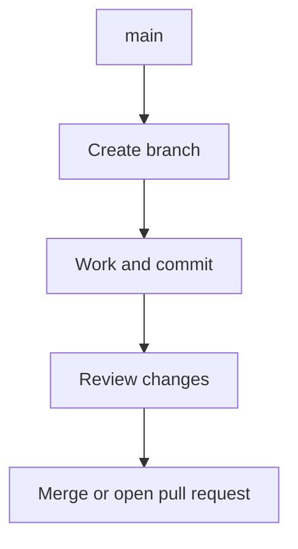

# Git branches

A branch is a movable name pointing to a line of commits. Branches let you isolate work, review changes, and merge completed work without disturbing another line of development.

## Branch tasks

| Task                              | Page                                                     |
| --------------------------------- | -------------------------------------------------------- |
| Create or switch branches         | [Create and switch branches](create-and-switch.md)       |
| Compare branches                  | [Compare branches](compare.md)                           |
| Combine completed work            | [Merge a branch](merge.md)                               |
| Update a branch safely            | [Rebase and synchronize](rebase-and-sync.md)             |
| Remove or recover branches        | [Delete and restore branches](delete-and-restore.md)     |
| Preserve files on a backup branch | [Archive files on a backup branch](archive-on-backup.md) |

!!! tip "Check your location first"

    Run `git status --short --branch` before branch operations. The first line shows the current branch and tracking state; the following lines show changed files.

## A focused branch cycle

