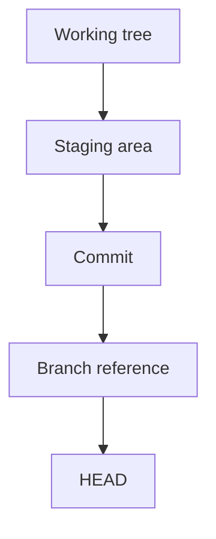

# Core Git concepts

Git becomes easier when its basic model is clear. Most everyday commands move changes between three areas: the working tree, the staging area, and the commit history.

## The three areas

| Area         | What it contains                                | Common command                 |
| ------------ | ----------------------------------------------- | ------------------------------ |
| Working tree | Files you are currently editing                 | `git diff`                     |
| Staging area | The exact snapshot prepared for the next commit | `git add`, `git diff --staged` |
| Repository   | Permanent commits and their history             | `git log`                      |

A commit does not automatically include every modified file. It records only what was staged.

## The reference model

`HEAD` identifies your current position. Usually it points to the current branch, and the branch points to the latest commit.

Branches are lightweight names that move when new commits are created. The commits themselves are the history; branch names are pointers into that history.

!!! tip "Start with status"

    When you are unsure where you are, run `git status --short --branch`. It reveals the current branch, tracking state, and changed paths.
