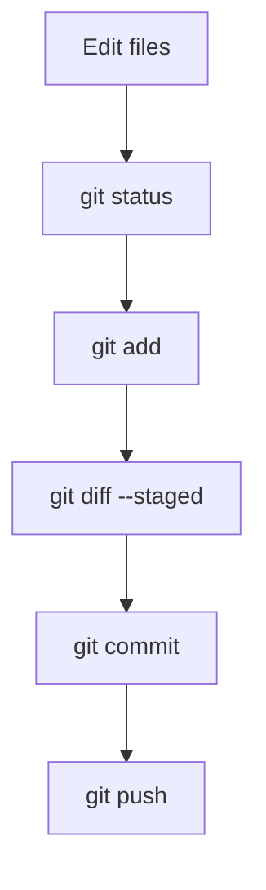

# Core Git commands

These commands cover the everyday local workflow. Run them from the project directory.

## Create or download a repository

```bash
# Create a repository in the current directory.
git init

# Download an existing repository and enter its directory.
git clone <repository-url>
cd <repository-directory>
```

## Inspect changes

```bash
# Show the current branch and working-tree state.
git status

# Show unstaged changes.
git diff

# Show commits in reverse chronological order.
git log --oneline --decorate --graph --all
```

## Stage and commit

```bash
# Stage one file.
git add <file>

# Stage all changes in the current directory.
git add .

# Create a commit from the staged snapshot.
git commit -m "Describe the change"
```

!!! tip "Review before committing"

    Use `git status` and `git diff --staged` after `git add`. A commit contains only staged changes, not every change in your working directory.

## Synchronize with a remote

```bash
# Download remote commits without changing your working tree.
git fetch origin

# Fetch and integrate the upstream branch into the current branch.
git pull --ff-only origin main

# Upload the current local branch to the remote.
git push origin main
```

`git pull` is effectively a fetch followed by an integration step. `--ff-only` prevents Git from creating an unexpected merge commit; resolve the situation deliberately if the branches have diverged.

## A normal change cycle


