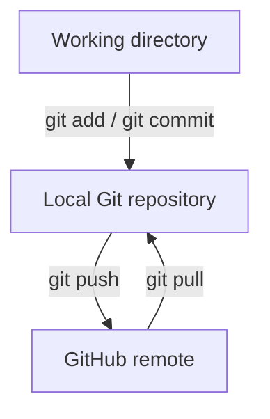

# Git and GitHub

Git and GitHub work together, but they are different tools.

## Git

Git is a distributed version control system installed on your computer. It records changes to files as commits, lets you create branches, and allows you to compare or restore earlier versions.

You use Git through a terminal, a graphical client, or an editor integration. The repository is the project folder plus the hidden `.git` directory that stores its history.

## GitHub

GitHub is a hosted service for Git repositories. It adds collaboration features such as pull requests, code review, issues, releases, permissions, and automated workflows.

Git can be used without GitHub. GitHub can host a Git repository, but it does not replace Git on your computer.

!!! info "The short version"

    **Git** tracks and manages project history locally. **GitHub** hosts repositories and supports collaboration remotely.

## How they connect

The remote is commonly named `origin`. Its URL points to a repository hosted on GitHub or another Git server.
