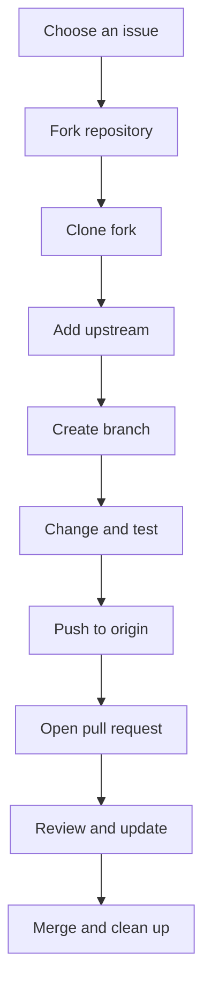

# Contribute to an open-source repository

When you contribute to a repository you do not own, you normally work through a fork and pull request. Your fork is your writable copy; the upstream repository is the project you want to improve.

## The remote roles

| Remote     | Usually points to    | Purpose                                 |
| ---------- | -------------------- | --------------------------------------- |
| `origin`   | Your fork on GitHub  | Push your branches and update your fork |
| `upstream` | The original project | Fetch the project's latest changes      |

Keeping these roles separate prevents an accidental push to the original repository.

## 1. Find a suitable issue

Start with the repository's contribution guide and issue tracker. Look for an issue that is clearly scoped and marked with labels such as `good first issue`, `help wanted`, or the relevant topic. Comment on the issue when the project asks contributors to coordinate before coding.

!!! tip "Read the repository rules first"

    Check `CONTRIBUTING.md`, the code of conduct, issue templates, pull request template, required checks, and supported versions before making changes.

## 2. Fork and clone

Fork the repository on GitHub, then clone **your fork** locally:

```bash
git clone https://github.com/<your-username>/<repository>.git
cd <repository>
```

Add the original repository as `upstream`:

```bash
git remote add upstream https://github.com/<owner>/<repository>.git
git remote -v
```

You should see `origin` pointing to your fork and `upstream` pointing to the original project.

## 3. Create an isolated branch

Start from an up-to-date local `main` branch:

```bash
git switch main
git fetch upstream
git pull --ff-only upstream main
git push origin main
```

Create a descriptive branch for the contribution:

```bash
git switch -c fix/<short-description>
```

Keep one focused change per branch. This makes review, testing, and follow-up fixes easier.

## 4. Make and verify the change

Follow the project's local setup and test instructions. Before committing, inspect the change:

```bash
git status --short
git diff
```

Stage only the files belonging to the contribution and create a focused commit:

```bash
git add <file-or-directory>
git commit -m "Fix <short description>"
```

Run the required checks before pushing:

```bash
git log -1 --oneline
git status --short
```

## 5. Push and open a pull request

Push the branch to your fork and set its upstream tracking branch:

```bash
git push --set-upstream origin fix/<short-description>
```

Open a pull request from your fork's branch to the original repository's `main` branch. Describe the problem, explain the change, link the issue, and include the checks you ran.

!!! note "Pull request target"

    The source is your fork and branch (`origin/fix/<short-description>`). The target is the original repository and its default branch (`upstream/main`).

## 6. Keep the branch current

While the pull request is under review, fetch updates from the original project:

```bash
git fetch upstream
git switch main
git pull --ff-only upstream main
git push origin main
```

If the project asks you to update your contribution branch, rebase it onto the current upstream branch:

```bash
git switch fix/<short-description>
git rebase upstream/main
```

Resolve conflicts if Git stops, then continue:

```bash
git add <resolved-file>
git rebase --continue
```

Because rebasing rewrites commit IDs, update the existing pull request branch carefully:

```bash
git push --force-with-lease origin fix/<short-description>
```

`--force-with-lease` is safer than `--force` because Git checks that the remote branch has not advanced unexpectedly.

## 7. Clean up after merging

After the pull request is merged, remove the local and remote feature branch if the project no longer needs it:

```bash
git switch main
git pull --ff-only upstream main
git branch -d fix/<short-description>
git push origin --delete fix/<short-description>
```

## Workflow at a glance


