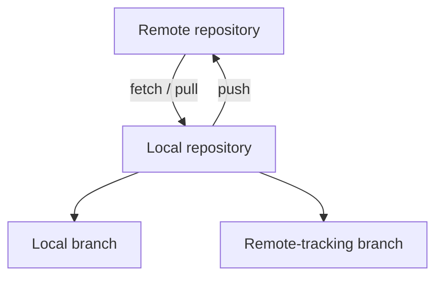

# Git remote workflows

A remote is another copy of a Git repository, usually hosted on GitHub. Remote commands transfer commits between your local repository and that server.

## Local and remote-tracking branches

Your local `main` branch and `origin/main` are different references. `origin/main` records the last remote state fetched locally; it does not update until you fetch.



The remote name `origin` is conventional, not special. It can be renamed or replaced.

## Before synchronizing

```bash
git status --short --branch
git remote -v
git branch --verbose --verbose
```

These commands show your working-tree state, remote URLs, and tracking relationships.
