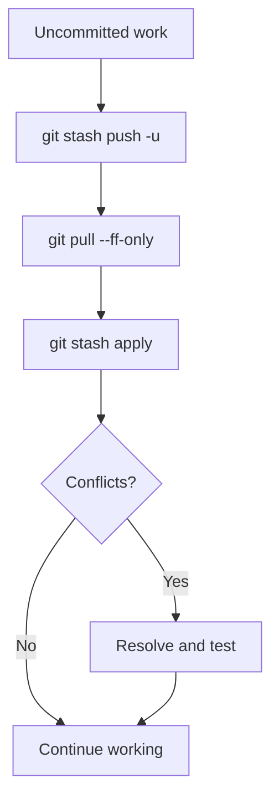

# Save and restore work with `git stash`

`git stash` saves selected uncommitted changes in a local snapshot and returns the working tree to a clean state. This is useful when you need to change branches, pull an update, or temporarily investigate another task.

## Save changes

```bash
# Save tracked modifications and staged changes.
git stash push -m "Describe the unfinished work"

# Include untracked files as well.
git stash push --include-untracked -m "Describe the unfinished work"
```

The short `-u` option is equivalent to `--include-untracked`:

```bash
git stash push -u -m "Add initial documentation"
```

Ignored files are not included. Use `--all` only when ignored files must also be stashed.

!!! tip "Prefer `stash push`"

    `git stash save` is older syntax. Use `git stash push -m "message"` because it makes the operation and message explicit.

## Inspect stashes

```bash
# List stashes from newest to oldest.
git stash list

# Show a summary of the latest stash.
git stash show

# Show the complete patch stored in the latest stash.
git stash show --patch
```

## Restore changes

```bash
# Apply the latest stash and keep it in the stash list.
git stash apply

# Apply a specific stash and keep it in the stash list.
git stash apply 'stash@{2}'

# Apply the latest stash and remove it if applying succeeds.
git stash pop
```

Use `apply` when you want a safety copy. Use `pop` when you are confident that the snapshot is no longer needed.

## Remove stashes

```bash
# Delete the latest stash.
git stash drop 'stash@{0}'

# Delete every stash after checking the list carefully.
git stash clear
```

## Create a branch from a stash

When the stashed work belongs on a new branch, create and switch to that branch while applying the snapshot:

```bash
git stash branch <branch-name> 'stash@{0}'
```

Git drops the stash if it applies successfully.

!!! danger "`clear` is destructive"

    `git stash clear` permanently removes all local stash entries. Inspect or export important work before using it.

## A common update workflow



If applying a stash produces conflicts, resolve the files, inspect the result with `git status`, and test before committing. Applying a stash does not automatically create a commit.
