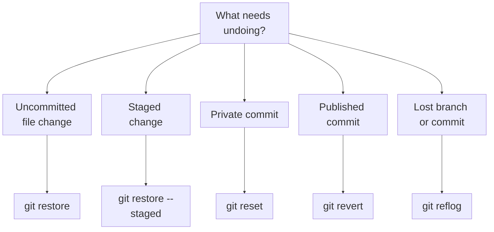

# Undo and recover Git changes

The correct undo command depends on where the change exists and whether other people may already have pulled it.

| Situation                                 | Use                           |
| ----------------------------------------- | ----------------------------- |
| Discard unstaged file edits               | `git restore <file>`          |
| Unstage a file but keep its edits         | `git restore --staged <file>` |
| Move a private branch backward            | `git reset`                   |
| Undo a published commit safely            | `git revert`                  |
| Find a previous branch or `HEAD` position | `git reflog`                  |

!!! warning "Check before destructive commands"

    Run `git status`, `git diff`, and `git log --oneline --decorate -n 5` before changing history. Stash or branch important work first.

## The decision path

